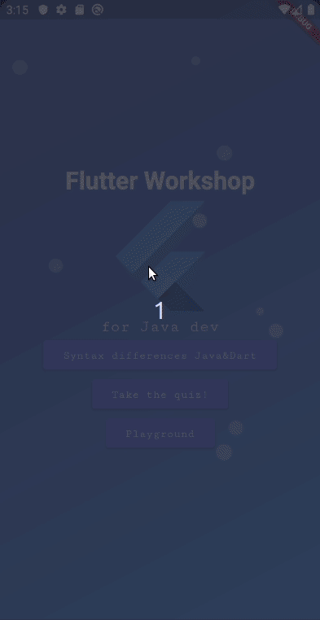

# Flutter Workshop

Small Flutter/Dart tutorial app with some quizzes, widgets playground, tutorial content.

## Some content from app:
Animations stutter on gifs, I will try to record another later.

- **Logo animation:**  
  

- **"Course" part** *- what I found different from Java and worth notice (there are still a lot of differences):*  
  

- **Quiz part** *- at the momment 1 quiz:*  
  

